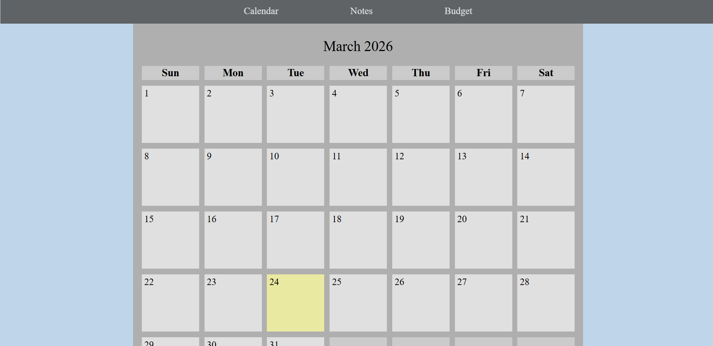
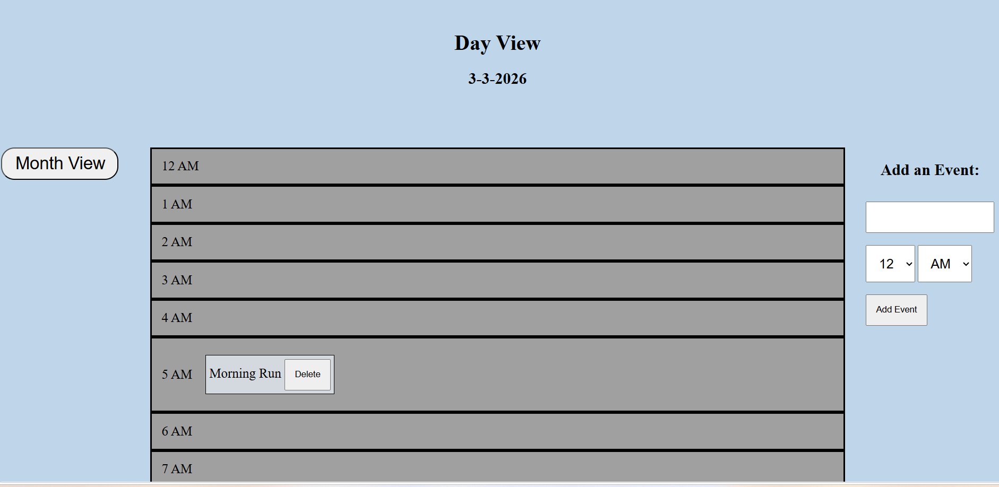
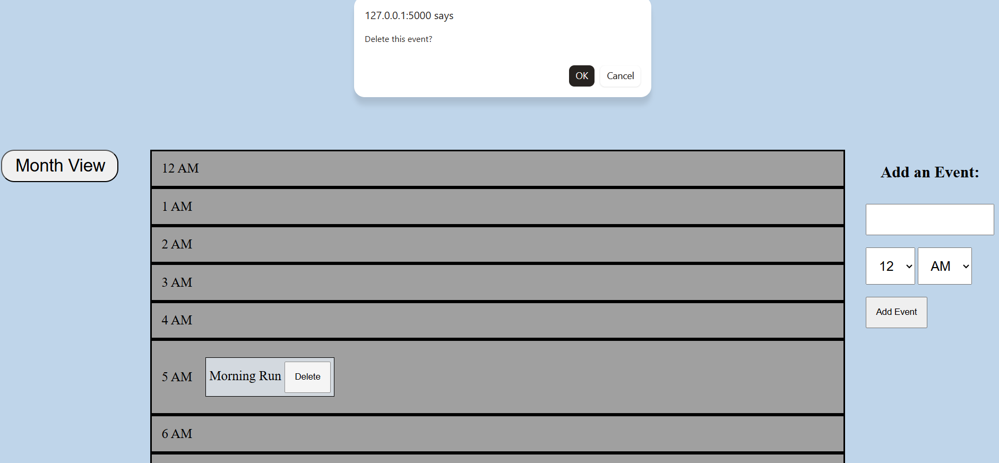
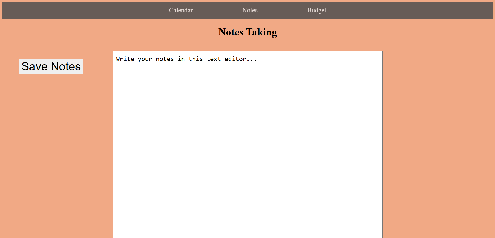
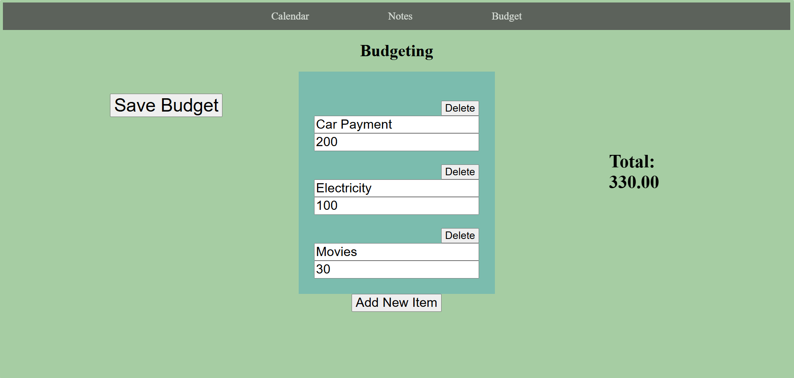
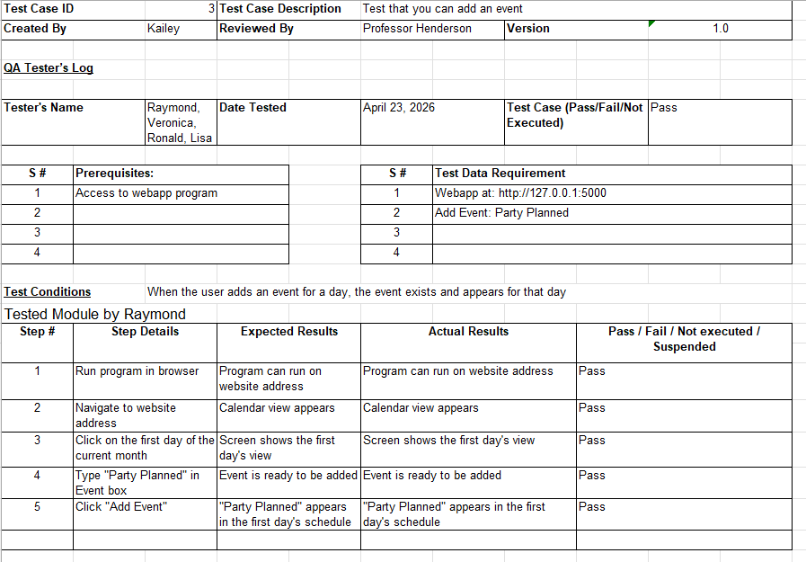

# Personal Management Application 

## “Personally Manage” 

 

<b>Student:</b> Kailey Owens 

<b>Degree and Major:</b> Bachelor of Computer Science; Computer Science 

<b>Project Advisor:</b> Professor Henderson 

<b>Expected Graduation:</b> 2026 

## Problem Statement:

Everyday life is a sporadic, difficult thing to keep track of. With so many responsibilities, people should have a method of organization to tackle their tasks with concise, ordered schedules. However, with how busy people are, many of them neglect the crucial process of detailing their tasks in a manageable level, leaving them to flounder when their work stacks up and gets out of control. This disorganization not only prevents people from accomplishing their work within acceptable timeframes and doing mediocre work, but it also causes unnecessary stress on the individuals that could be avoided with proper management. 

I propose an application that will allow users to organize and keep track of events in their lives. With features set out for users to understand their responsibilities as clearly as possible, it will act as a single place to differentiate one task from the next. This application will help people have a clear path throughout their lives, relieving stress and increasing productivity. People struggle with establishing balance in their chaotic lives, but with their responsibilities efficiently managed with this personal management application, users will have less stress, gain more free time, and produce better work. 

<b>Project Description:</b> This project revolves around helping its users manage their work and keeping track of future events. This program has features such as a calendar, notes, and budgeting. Its goal is productivity and clear scheduling. 

<b>Implementation Languages:</b> Python, HTML/CSS, JavaScript 

<b>Libraries, Packages, Development Kits, etc. that were used in the proposed implementation languages:</b> Flask, sqlite3, Jinja 

<b>Additional Software/Equipment Needed:</b> Computer, computer device with internet, access to GitHub and terminal 

<b>Personal Motivation:</b> This project challenged me to work with languages I have little experience with, such as JavaScript. It allowed me to work with a database and solve unique problems. 

 

## Functional Requirements
```
ID Number: 2 
Type: 4.iii 
Description: Clicking on page icons direct the user to their corresponding pages 
Rationale: Allows each functional page to be accessed clearly and easily 
Fit Criterion: Users will have access to all needed parts of the software 
Priority: High 
Dependencies: 1, 3 
```
```
ID Number: 3 
Type: 6.i 
Description: Each page has an icon that represents and contains the link for the page 
Rationale: Users must know where to find the pages for calendar, notes, etc. To access the management functions 
Fit Criterion: Users can easily maneuver around the website 
Priority: High 
Dependencies: 1 
```
```
ID Number: 4 
Type: 3.v 
Description: Calendar contains each day of the month, by each month and specified for each month, and the year. Acts as home page for website 
Rationale: Calendar is significant for personal management so it will need basic calendar design 
Fit Criterion: Basic calendar exists for users to keep track of time 
Priority: High 
Dependencies: 1 
```
```
ID Number: 6 
Type: 3.ii 
Description: Each day can be viewed on a wider scale and can set times for reminders 
Rationale: Part of manageability is allowing the user to detail their specific schedule 
Fit Criterion: Users will be able to mark down specific events or times for their needs 
Priority: High 
Dependencies: 1, 4 
```
```
ID Number: 9 
Type: 3.v 
Description: There exists a notes section/page that gives the user basic writing ability 
Rationale: Notes are another important personal management ability as it helps people think through their thought processes and write their ideas down 
Fit Criterion: User will have another personal management function to use in the form of general writing 
Priority: High 
Dependencies: 1, 2, 3 
```
```
ID Number: 11 
Type: 3.iv 
Description: Budgeting section that takes in numbers and calculates monetary budgets based on them 
Rationale: Finances are very important for a person, and this will provide a better understanding on where people are with their money 
Fit Criterion:  
Priority: High 
Dependencies: 1, 2, 3 
```
```
ID Number: 12 
Type: 3.iv 
Description: Gives the user an option to change the criteria of the output for their budget 
Rationale: Having more options to explore a person’s budget will give a greater understanding to their financial situation 
Fit Criterion: User can determine what their budget will be by month, year, with less savings per month, more savings, etc. 
Priority: Medium 
Dependencies: 1, 2, 3, 11 
```
```
ID Number: 16 
Type: 3.ii 
Description: Each day in calendar has the options to create reminders with names, and they will show up in the listed view of the hours of the day 
Rationale: Personalization for the calendar is important for personal management, allowing reminders on the schedule 
Fit Criterion: Users will see existing events in the day and points on the months marking their events 
Priority: High 
Dependencies: 1, 4, 6 
```
```
ID Number: 18 
Type: 3.vi 
Description: There is a back button that will take the users back to the previous page they are on 
Rationale: Moving from page to page may be tedious, especially in the calendar section with more pages 
Fit Criterion: Users will have the option to quickly go back to the page they last visited 
Priority: Low 
Dependencies:  
```
```
ID Number: 19 
Type: 4.iii 
Description: Calendar feature contains set information for at least the next dozen years into the future 
Rationale: There should be a minimum date times that may be understood from the application from launch 
Fit Criterion: There is at least so many years set to work and can have additional times added on as years go by 
Priority: High 
Dependencies: 
```

 

3. Usability 

i. Ease of Use – clear and concise visual instruction that leads the users to their desired destination 

ii. Personalization and Internationalization – Each user’s application may be heavily personalized to fit their schedules and taste; the app is not international and specific to America 

iii. Learning – The program does not learn or teach 

iv. Understandability and Politeness – The application is created to be understandable with an easy-to-read set of icons 

v. Accessibility – Those with a computer device that has access to safari/google can access the website 

vi. Convenience – This application is meant to be as convenient as possible, with a goal of making everyday life more convenient for its users 

4. Performance 

i. Speed and Latency – It should have a reasonable speed, one that is unnoticeable by the user 

ii. Safety-Critical – Privacy is the main safety concern, which should not be an issue 

iii. Precision or Accuracy – Math, dates, and written text should all work as they are meant to with any accuracy they require 

iv. Reliability and Availability – available to those with computers containing google; reliable for its functions 

v. Robustness or Fault-Tolerance – Does not need to be extremely robust 

vi. Capacity – contains information on dates and times 

vii. Scalability or Extensibility – Small scale with few sections but available to multiple users in the same application setting 

viii. Longevity – Years which can be added upon as needed 

5. Maintainability and Support – Support bug fixes and improvements upon the core application 

6. Security 

i. Access – Users are free to access their personal acquired application 

ii. Integrity – Functions work together to form a cohesive and ethical whole 

iii. Privacy – user information is stored and protected within the database 

iv. Audit (what information must be recorded to allow security checks. e.g., logs) - database containing user information and any discrepancies 

7. Cultural – there are no current plans to extend the service outside of America and the English language 

 

## Description & Explanation: 
<b>GitHub link:</b> https://github.com/KaileyMO/Time-Management-Project

To compile and run this program for the first time you must do the following steps: 

1. Clone code from GitHub 

2. Install a python environment 

    a)  ‘sudo apt install python3-venv' 

    b)  ‘python3 -m venv venv’ 

    c)  ‘source venv/bin/activate’ 

3. Install pip with ‘sudo apt install python3-pip' 

4. Install Flask with ‘pip install Flask’ 

5. Run schema.py by typing 'python3 schema.py'

6. Run the application by typing 'python3 app.py' and paste this web page in your web browser: http://127.0.0.1:5000 

After <b>successfully running the program once</b>, you can use it any other time by: 

1. Opening the path to this application from your terminal 

2. Open your python environment with ‘source venv/bin/activate’ 

3. Run the application by typing 'python3 app.py' and paste this web page in your web browser: http://127.0.0.1:5000 

Upon startup, the webpage opens on the main calendar menu of the current month (<i>Fig 1. Main Calendar screen</i>). This page will contain all the months of the year and whether or not days contain an event. 


<b>Fig 1. </b>

Clicking a day’s number will bring you to the day view (<i>Fig 2. specific day’s schedule</i>) for that day. Here, you can create, delete, or observe events. These events are stored in hourly timeslots. 

 

<b>Fig 2.</b> 

 

Trying to delete an event will cause the program to give a confirmation alert (<i>Fig 3. User attempting to delete an event</i>). 


<b>Fig 3.</b> 

In the main calendar menu (<i>Fig 1. Main Calendar screen</i>), click on “Notes” to be sent to the Notes page (<i>Fig 4. Notes/text editor view</i>). Here, you can write text to the screen and save it to the program. 

 

<b>Fig 4. </b>

Click on “Budget” to be taken to the budgeting section (<i>Fig 5. page to calculate user budget</i>). You will have the options to edit the budgeting items, delete/add and item, and save your constructed budget to the program. 


<b>Fig 5. </b>

 

Test Plan: I created several test cases for multiple testers to follow along. After doing this, the testers answered a survey of seven questions. The full test cases and the answers to the survey are located in the “Senior_Project_testers” excel file. 

Test Case sample: 


 

Survey questions after use: 

1. What did you like best? 

2. What did you not like? 

3. Was everything clear and easy to navigate? 

4. What do you think is most useful between Calendar, Notes, and Budget? Least useful? 

5. Would you use this app? Why or why not? 

6. What changes would you make to this application? 

7. How satisfied were you with this product? 

 

## Test Results: 
The tests were successful, and the responses from the testers showed a diverse range of users who would use this program. When asked about the most and least useful sections of the program, there were a variety of answers with no definitive favorites or least favorites. This personal application is meant to service the individual needs of the users, so it was a good sign to see that there was something for everyone. 

 

 

## Challenges Overcome: 
I do not have much experience working on web applications, so it was a bit of a learning curve to figure everything out. Specifically, with multiple ways of interacting with html such as Jinja, JavaScript, or POSTing through Flask, it was sometimes difficult to decide on the best path. Through testing, and sometimes trial and error, I was able to learn and adapt enough to work with these unfamiliar concepts. 

One specific challenge was figuring out how to handle actions with branching consequences. Adding an event on a calendar day, for example, required connecting not only to the database but to all the areas where that event will have occured, such as showing up in the day in the month, existing in the day view, and appearing at the correct time slot. Similarly, balancing the ability to create user input and only save it after a button click was another tedious task with an unclear path for it. However, I got through these challenges by testing, finding existing methods or libraries, and navigating html and Flask to put everything together. 

 

## Future Enhancements: 
There are many ways to build from this foundational application. In the future, I could expand on existing features, such as adding alerts for specified events, or giving the user more control over the order of the budget items. This could very well become a scalable project, especially one that was a solid foundation put in place. 

 

## Defense Presentation Slides: 
The slides going over this application can be found as “Personal_Management_Presentation” in this current GitHub folder, or: https://github.com/KaileyMO/Time-Management-Project/docs